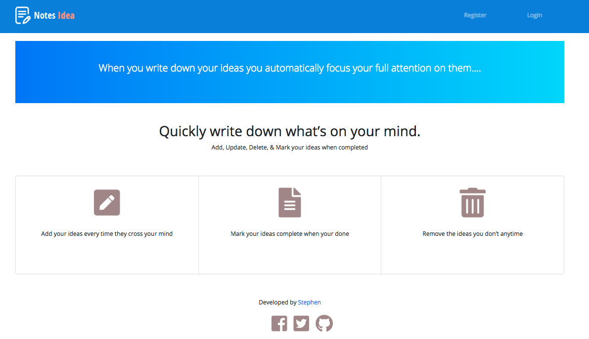

# Notes Application
This is a node js application that enables a user to to quickly note down his ideas

Checkout the [demo](https://notes-pro.herokuapp.com/) on heroku

## Look and Feel


## Key Features
1. User can create an account
2. User can login 
3. User can add notes
4. User can update notes
5. User can delete notes
6. User can view notes

## Technologies used
1. Node Js
2. MongoDB

## Getting Started
The quickest way to get started is to clone the repository:

```sh
# clone the repository by typing the command below in your terminal
$ git clone https://github.com/SendiSteve/notes_idea.git

# change the directory
$ cd notes_idea

# install all the required dependencies
$ npm install

# Start the server
$ node app.js
```
**Note**: Highly suggest you install [nodemon](https://nodemon.io/). It will monitor for any changes in your source and automatically restart your server saving you lots of time.

```sh
# To install, from your terminal run
$ npm install -g nodemon

# Once installed, instead of `node app.js` use 
$ nodemon app.js.
```

### Todos
- Write tests
- Share your ideas publicly to allow other users comment and give feedback


